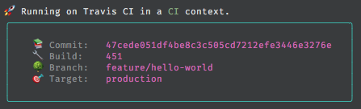

# build-header

> Adds a pretty header to your build scripts.



Uses [env-ci](https://github.com/pvdlg/env-ci) under the hood, so should more-or-less pick up on your ci.

## Install

```sh
yarn add build-header -D
```

## Usage

```js
// build-file.js

const buildHeader = require('build-header');

console.log(buildHeader());
```
